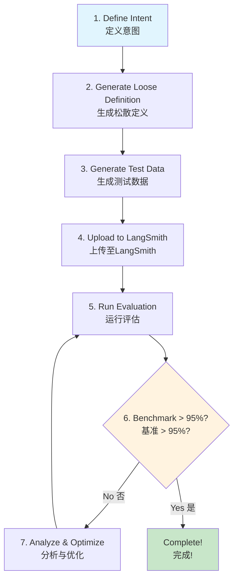
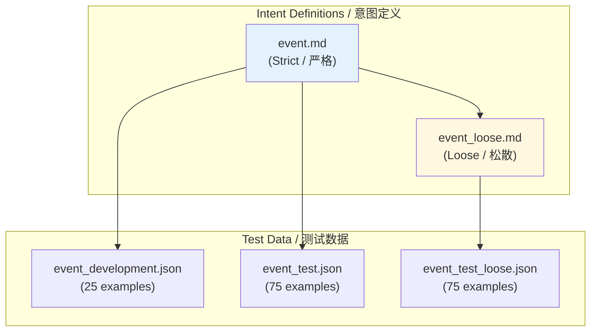
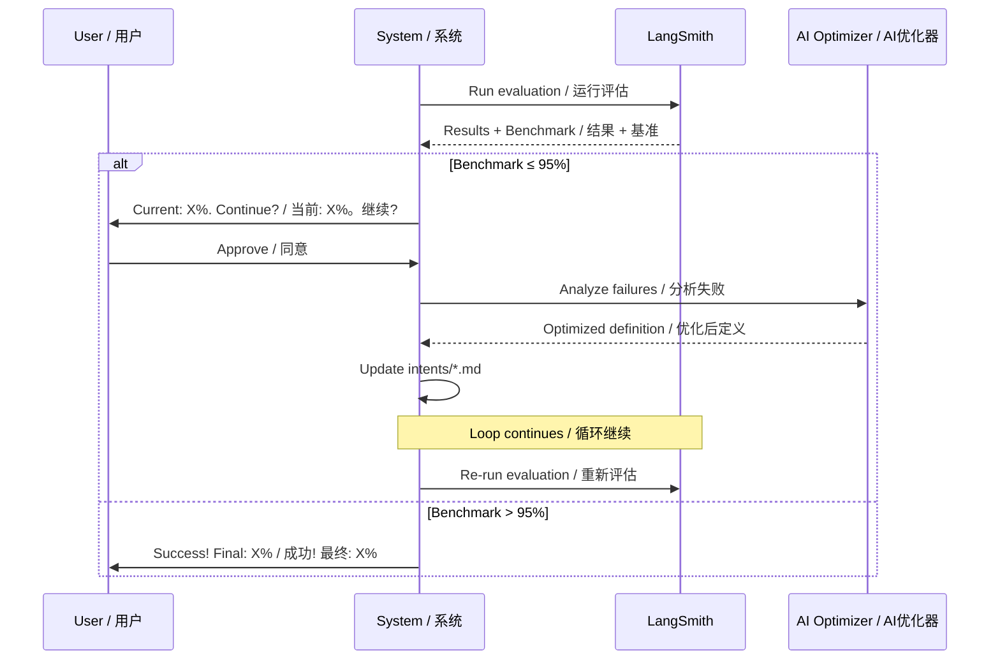
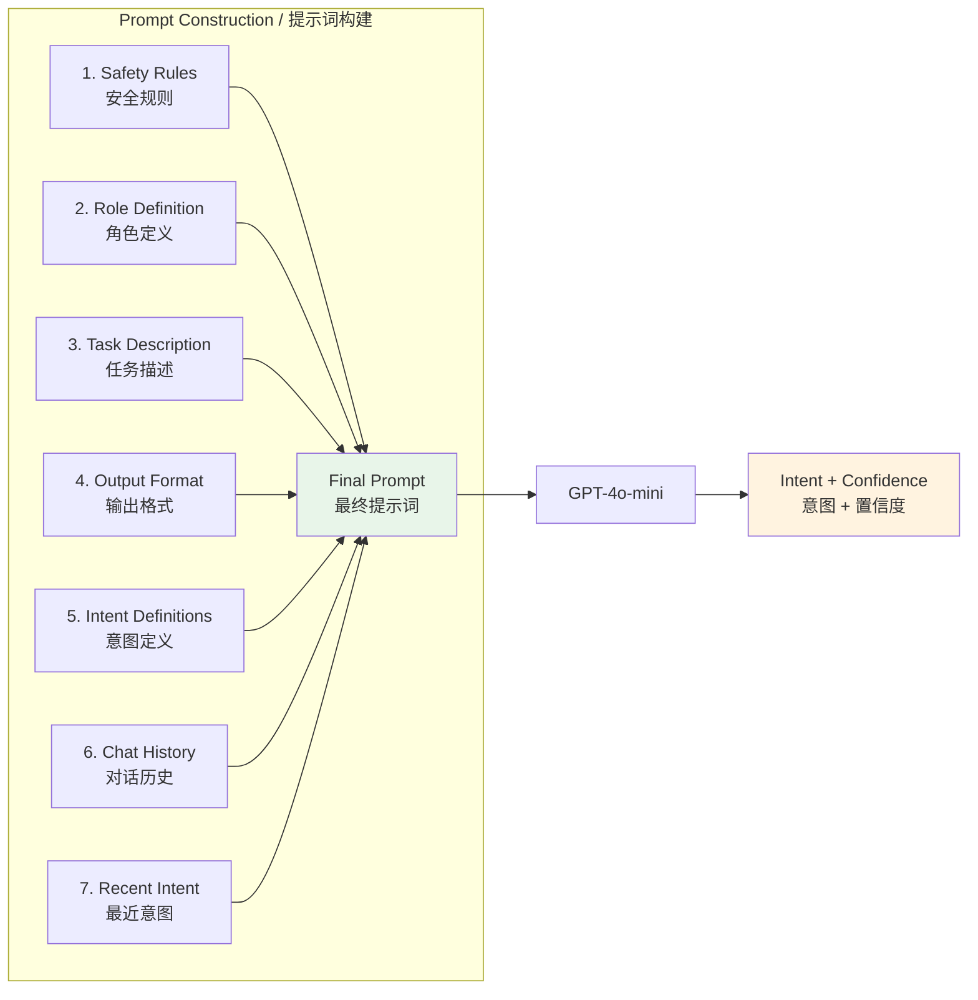
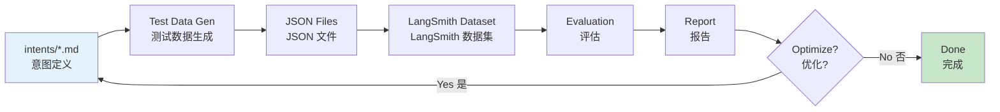

# LLM Intent Router Test Dataset / LLM 意图路由测试数据集

A **self-evolving** intent classification system powered by LLM, featuring automated evaluation, report generation, and iterative optimization until benchmark targets are achieved.

一个基于大语言模型的**自演化**意图分类系统，支持自动化评估、报告生成，以及迭代优化直到达成目标基准。

## Key Features / 核心特性

- **Self-Evolving Loop / 自演化循环**: Automatically iterate until classification benchmark exceeds 95%
- **Strict & Loose Definitions / 严格与松散定义**: Dual-layer intent definitions for robust testing
- **LangSmith Integration / LangSmith 集成**: Cloud-based dataset management and experiment tracking
- **Structured Output / 结构化输出**: Zod-validated responses with confidence scoring (0-100)
- **Context Compression / 上下文压缩**: Gemini-powered chat history compression for long conversations

---

## Quick Start / 快速开始

### Prerequisites / 前置条件

- Node.js 18+
- pnpm
- API Keys: OpenAI, LangChain (LangSmith), Gemini (optional)

### Installation / 安装

```bash
# Clone the repository
git clone https://github.com/bianbianzhu/llm-router-test-dataset.git
cd llm-router-test-dataset

# Install dependencies
pnpm install

# Configure environment variables
cp .env.example .env
# Edit .env with your API keys
```

### Environment Variables / 环境变量

Create a `.env` file with:

```env
OPENAI_API_KEY=your_openai_key
LANGCHAIN_API_KEY=your_langsmith_key
GEMINI_API_KEY=your_gemini_key  # Optional, for context compression
```

---

## Complete Workflow / 完整工作流程

The system follows a 7-step self-evolving workflow:

系统遵循7步自演化工作流程：



---

## Phase 1: Intent Definition / 阶段1：意图定义

Intent definitions are the foundation of classification. Each intent is defined in a Markdown file following a specific structure.

意图定义是分类的基础。每个意图都在一个遵循特定结构的 Markdown 文件中定义。

### Template Structure / 模板结构

Reference: [`template.md`](./template.md)

```markdown
## <Intent Name>

**Definition:**
This intent encompasses all inquiries related to...
- Category 1: ...
- Category 2: ...

**Key Notes:**
- Important boundary conditions
- Classification rules

**Examples:**
- "Example user query 1"
- "Example user query 2"
```

### Strict vs Loose Definitions / 严格与松散定义



| Type / 类型 | File Pattern / 文件模式 | Purpose / 目的 |
|-------------|------------------------|----------------|
| Strict / 严格 | `intents/<name>.md` | Precise boundaries, used in production prompts / 精确边界，用于生产提示词 |
| Loose / 松散 | `intents/<name>_loose.md` | Broader variations, tests robustness / 更广泛变体，测试鲁棒性 |

### Workflow Steps (from toml_prompt_v1.1.md) / 工作流步骤

**Step 1: Generate Intent Definition / 步骤1：生成意图定义**
1. Read the template from `template.md`
2. Generate Markdown content based on intent type
3. Save to `intents/<intent_name>.md` (use `snake_case`)

**Step 2: User Validation / 步骤2：用户验证**
1. User reviews the generated file
2. Makes manual corrections if needed
3. Confirms with "完成" (Done) to proceed

**Step 3: Generate Loose Definition / 步骤3：生成松散定义**
1. Read the strict definition file
2. Create a more inclusive/general version
3. Save to `intents/<intent_name>_loose.md`

---

## Phase 2: Test Data Generation / 阶段2：测试数据生成

Three types of test datasets are generated from intent definitions:

从意图定义生成三种类型的测试数据集：

| Dataset / 数据集 | Count / 数量 | Source / 来源 | Purpose / 目的 |
|-----------------|--------------|--------------|----------------|
| Development / 开发集 | 25 | Strict definition / 严格定义 | Tuning & debugging / 调试 |
| Test / 测试集 | 75 | Strict definition / 严格定义 | Standard evaluation / 标准评估 |
| Loose Test / 松散测试集 | 75 | Loose definition / 松散定义 | Robustness testing / 鲁棒性测试 |

### JSON Format / JSON 格式

```json
[
  {
    "id": "uuid-here",
    "input": "User query text",
    "intent": "intent_name"
  }
]
```

### File Naming Convention / 文件命名规范

```
test_data/
├── <intent>_development.json    # 25 examples from strict definition
├── <intent>_test.json           # 75 examples from strict definition
└── <intent>_test_loose.json     # 75 examples from loose definition
```

---

## Phase 3: LangSmith Integration / 阶段3：LangSmith集成

Upload generated test data to LangSmith for cloud-based evaluation.

将生成的测试数据上传到 LangSmith 进行云端评估。

### Upload Command / 上传命令

```bash
pnpm create:dataset <datasetName> [options]

# Options:
#   -f, --fileName <prefix>   File prefix (e.g., "faq" for faq_test.json)
#   -t, --type <type>         Dataset type: "test" or "loose"
```

### Examples / 示例

```bash
# Upload standard test data
pnpm create:dataset intent_classification_dataset -f event --type test

# Upload loose test data
pnpm create:dataset intent_classification_dataset_loose -f event --type loose

# Upload all test files (no -f specified)
pnpm create:dataset intent_classification_dataset --type test
```

### Default Datasets / 默认数据集

| Dataset Name / 数据集名称 | File Type / 文件类型 |
|--------------------------|---------------------|
| `intent_classification_dataset` | `*_test.json` |
| `intent_classification_dataset_loose` | `*_test_loose.json` |

---

## Phase 4: Evaluation / 阶段4：评估

Run evaluation against LangSmith datasets and generate detailed reports.

对 LangSmith 数据集运行评估并生成详细报告。

### Evaluation Command / 评估命令

```bash
pnpm eval:report <datasetName> [options]

# Options:
#   -p, --prefix <prefix>       Experiment name prefix (auto-generated)
#   -c, --concurrency <level>   none | low (default) | high
```

### Examples / 示例

```bash
# Standard evaluation
pnpm eval:report intent_classification_dataset

# High concurrency for large datasets (>1000 samples)
pnpm eval:report intent_classification_dataset -c high
```

### Report Structure / 报告结构

Reports are generated in `evaluation/reports/` with:

报告生成在 `evaluation/reports/` 目录，包含：

- **Benchmark Score / 基准分数**: Overall accuracy percentage
- **Failure Cases / 失败案例**: Grouped by intent with detailed analysis
- **Optimization Prompt / 优化提示**: Chinese task prompt for intent refinement

---

## Phase 5: Self-Evolution Loop / 阶段5：自演化循环

The core innovation: automatically iterate until classification performance exceeds 95%.

核心创新：自动迭代直到分类性能超过 95%。



### Decision Logic / 决策逻辑

| Condition / 条件 | Action / 行动 |
|-----------------|---------------|
| Benchmark > 95% AND failures distributed | **Stop** - optimization complete / **停止** - 优化完成 |
| Benchmark ≤ 95% | **Continue** - analyze and optimize / **继续** - 分析与优化 |
| Single intent has >50% failures | **Prioritize** - focus on that intent / **优先** - 聚焦该意图 |

### Optimization Process (from toml_prompt_eval_v1.md) / 优化过程

1. **Read Report / 读取报告**: Parse benchmark and failure cases
2. **Analyze Failures / 分析失败**: Identify patterns in misclassifications
3. **Rewrite Definition / 重写定义**: Make boundaries clearer and more precise
4. **Update File / 更新文件**: Overwrite `intents/<intent>.md` (NEVER modify `*_loose.md`)
5. **Re-evaluate / 重新评估**: Run evaluation again with updated definitions

---

## Architecture / 架构

### System Prompt Construction / 系统提示词构建

The system dynamically constructs prompts with 8 components:

系统动态构建包含8个组件的提示词：



Key files:
- `prompts/system_prompt.ts`: Constructs the 8-part prompt
- `intents/*.md`: Loaded dynamically (excluding `*_loose.md`)
- KV Cache optimization: Validates static portion exceeds 1024 tokens

### Intent Classifier Pipeline / 意图分类器流水线


Key files:
- `src/intent_classifier/index.ts`: Main classifier using LangChain
- `src/intent_classifier/schema.ts`: Zod schema for structured output

```typescript
// Valid intents defined in schema.ts
const intents = [
  "coupon",
  "FAQ",
  "wine_recommendation",
  "membership",
  "delivery status",
  "event"
];
```

### Context Compression (Optional) / 上下文压缩（可选）

For long conversations, the system compresses chat history using Gemini:

对于长对话，系统使用 Gemini 压缩对话历史：

- **Trigger / 触发**: When token count exceeds 70% of limit
- **Preserve / 保留**: 30% of most recent messages
- **Model / 模型**: Gemini for summarization
- **Output / 输出**: State snapshot format

Key file: `compression/context_compression.ts`

---

## Data Pipeline / 数据流水线



---

## Command Reference / 命令参考

### Core Commands / 核心命令

| Command / 命令 | Description / 描述 |
|----------------|-------------------|
| `pnpm install` | Install dependencies / 安装依赖 |
| `pnpm test` | Run tests (interactive) / 运行测试（交互式） |
| `pnpm test:run` | Run tests (single run) / 运行测试（单次） |
| `pnpm test:watch` | Run tests (watch mode) / 运行测试（监听模式） |
| `pnpm show:prompt` | Display constructed system prompt / 显示构建的系统提示词 |

### Dataset Commands / 数据集命令

```bash
# Create/update LangSmith dataset
pnpm create:dataset <datasetName> [options]
  -f, --fileName <prefix>   # File prefix
  -t, --type <test|loose>   # Dataset type (default: test)

# Examples
pnpm create:dataset my-dataset -f faq --type test
pnpm create:dataset my-dataset-loose -f faq --type loose
```

### Evaluation Commands / 评估命令

```bash
# Run evaluation and generate report
pnpm eval:report <datasetName> [options]
  -p, --prefix <prefix>           # Experiment name prefix
  -c, --concurrency <level>       # none | low | high

# Examples
pnpm eval:report intent_classification_dataset -c high
```

### Utility Commands / 实用命令

```bash
# List datasets, view examples
pnpm langsmith:basic --operation list-datasets
pnpm langsmith:basic --operation list-examples --dataset <name>
```

---

## Customization Guide / 自定义指南

### Adding New Intents / 添加新意图

1. Create `intents/<new_intent>.md` following `template.md` structure
2. Create `intents/<new_intent>_loose.md` for broader variations
3. Update `src/intent_classifier/schema.ts`:

```typescript
export const intentClassificationOutputSchema = z.object({
  intent: z.enum([
    "coupon",
    "FAQ",
    "wine_recommendation",
    "membership",
    "delivery status",
    "event",
    "new_intent"  // Add here
  ]),
  confidence: z.number().int().min(0).max(100)
});
```

4. Generate test data and upload to LangSmith
5. Run evaluation to validate

### Modifying Thresholds / 修改阈值

**Benchmark Threshold (95%)**: Edit in your optimization workflow

**Context Compression Threshold (70%)**: Edit in `compression/context_compression.ts`

**KV Cache Threshold (1024 tokens)**: Edit in `prompts/system_prompt.ts`

### Changing LLM Providers / 更改 LLM 提供商

**Classifier Model**: Edit `src/intent_classifier/index.ts`

```typescript
// Change from GPT-4o-mini to another model
const model = new ChatOpenAI({
  model: "gpt-4o",  // or other OpenAI models
  temperature: 0.2
});
```

**Compression Model**: Edit `compression/context_compression.ts` to use different Gemini models or switch to OpenAI.

---

## Project Structure / 项目结构

```
llm-router-test-dataset/
├── src/
│   └── intent_classifier/
│       ├── index.ts          # Main classifier pipeline
│       └── schema.ts         # Zod schema for intents
├── prompts/
│   ├── system_prompt.ts      # 8-part prompt construction
│   └── show_prompt.ts        # CLI to display prompt
├── intents/
│   ├── *.md                  # Strict intent definitions
│   └── *_loose.md            # Loose intent definitions
├── test_data/
│   ├── *_development.json    # Development datasets (25 each)
│   ├── *_test.json           # Test datasets (75 each)
│   └── *_test_loose.json     # Loose test datasets (75 each)
├── evaluation/
│   ├── scripts/
│   │   ├── eval.ts           # Core evaluation logic
│   │   ├── evaluator.ts      # Strict equal evaluator
│   │   ├── eval_report.ts    # Report generation
│   │   ├── create_dataset.ts # LangSmith upload
│   │   └── data_formatter.ts # JSON to LangSmith format
│   └── reports/              # Generated evaluation reports
├── compression/
│   └── context_compression.ts # Gemini-based compression
├── template.md               # Intent definition template
├── toml_prompt_v1.1.md       # Intent creation workflow (CN)
├── toml_prompt_eval_v1.md    # Evaluation workflow (CN)
├── CLAUDE.md                 # AI agent reference
└── README.md                 # This file
```

---

## Workflow Files Reference / 工作流文件参考

For AI agents (Claude, Gemini CLI, etc.) to execute the complete workflow:

用于 AI 代理（Claude、Gemini CLI 等）执行完整工作流：

| File / 文件 | Purpose / 目的 |
|------------|----------------|
| `toml_prompt_v1.1.md` | Intent creation & data generation workflow (Steps 0-7) / 意图创建与数据生成工作流（步骤0-7） |
| `toml_prompt_eval_v1.md` | Evaluation & self-evolution workflow (Steps 1-3) / 评估与自演化工作流（步骤1-3） |
| `template.md` | Intent definition template / 意图定义模板 |

### Using with Gemini CLI / 在 Gemini CLI 中使用

To use these workflow files as slash commands in Gemini CLI:

将工作流文件作为 Gemini CLI 的斜杠命令使用：

```bash
# Copy workflow files to Gemini commands folder
# 将工作流文件复制到 Gemini 命令文件夹
cp toml_prompt_v1.1.md ~/.gemini/commands/create_intent.md
cp toml_prompt_eval_v1.md ~/.gemini/commands/eval_intent.md
```

After copying, you can use them as slash commands in Gemini CLI:

复制后，可以在 Gemini CLI 中使用斜杠命令：

```bash
# In Gemini CLI / 在 Gemini CLI 中
/create_intent event      # Create new "event" intent / 创建新的 "event" 意图
/eval_intent              # Run evaluation workflow / 运行评估工作流
```

> **Tip / 提示**: You can rename the files to any name you prefer. The filename (without `.md`) becomes the slash command name.
>
> 你可以将文件重命名为任何喜欢的名字。文件名（不含 `.md`）将成为斜杠命令名称。

---

## Contributing / 贡献

1. Fork the repository
2. Create a feature branch
3. Follow existing code patterns
4. Add tests for new functionality
5. Submit a pull request

## License

ISC
